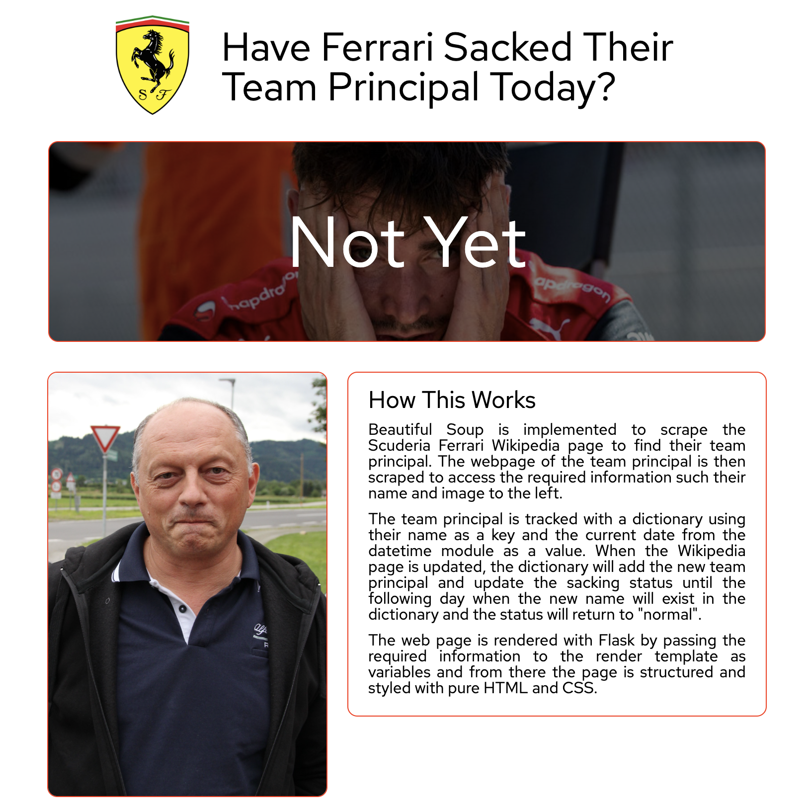

# Have Ferrari Sacked Their Team Principal Today 
This purpose of this project is to build a website which runs on Flask and implements webscraping to update its content.

The deployment of the website is available at the following links with a screenshot displayed below:

* http://www.haveferrarisackedtheirteamprincipaltoday.com/
* https://whos-the-boss.herokuapp.com/

## Description % Implementation

Beautiful Soup is implemented to scrape the Scuderia Ferrari Wikipedia page to find their team principal. The webpage of the team principal is then scraped to access the required information such their name and the image with the hover over effect.

The team principal is tracked with a dictionary using their name as a key and the current date from the datetime module as a value. When the Wikipedia page is updated, the dictionary will add the new team principal and update the sacking status until the following day when the new name will exist in the dictionary and the status will return to "normal".

The web page is rendered with Flask by passing the required information to the render template as variables and from there the page is structured and styled with pure HTML and CSS. The web page has been deployed from GitHub to Heroku and the fifteen euro investment required to secure the domain is worth eveery penny.

## Languages & Frameworks

